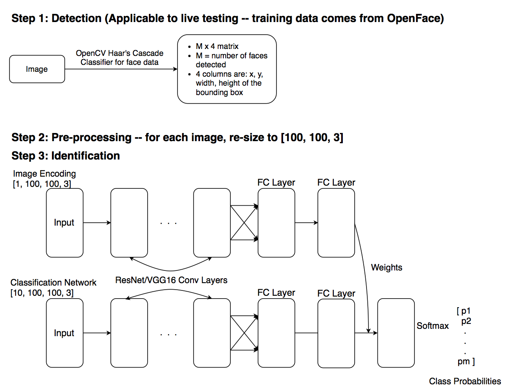
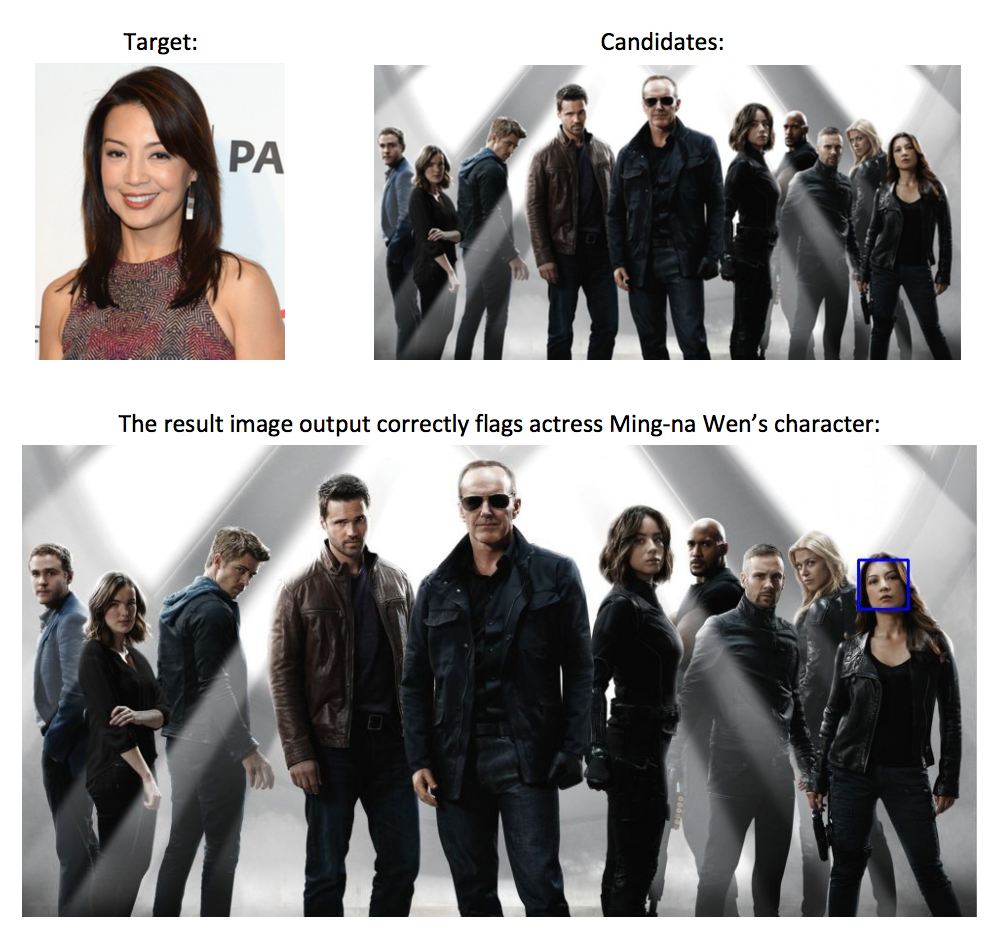

## Introduction
Recent advances in computer vision research have focused on the development of highly accurate facial detection systems. There has been much success in this area with highly accurate facial detectors widely available for public use. A natural extension of facial detection is the comparison of faces to determine if they are the same person. This problem has been explored by researchers in depth and has resulted in the introduction of Siamese Networks that effectively handle the direct comparison of two faces. This model will be discussed further in the “Relevant Works” section. However, should a user want to compare a face to a series of other faces in an image, the user would need to run this model with their suspect against each candidate face and compare the resulting similarity factors. There has been significantly less effort spent on solving this problem despite the numerous possible uses for a working model.

Our model, CSEye, attempts to address the problem of simultaneous facial comparison by parallelizing the image encoding and comparison of the candidate images to the suspect. This is done by stacking the candidate images in the channels dimension of the input matrix to enable the processing simultaneously. We initialize our model using VGG weights and fine tune using the “Labelled Faces in the Wild” dataset. We will begin our in-depth discussion with an overview of related works, the problem formulation, the model structure and training and then discuss the results of our experiments and associated conclusions.

## Relevant Work
The traditional classification task, with CNNs, involves training on a massive amount of training samples across multiple classes and then, for a given test image, outputting a number of class probabilities that would be used to predict a given class. This of course implies that we have many training samples for each class, but what if we only have one? The idea behind Siamese networks is to use contrast to predict whether a candidate image is in the same class as another known image, and through this identify the test image’s associated class.

This process is done by training two neural networks simultaneously with all of the training data and a contrastive loss function as opposed to more traditional loss functions like cross entropy. At the end, both networks would have the same structure. In the prediction phase a candidate image is put through the first of the networks while another image, whose label is known, is put through the other. When both of the image imbeddings are computed, the contrastive loss of the two is calculated and used to decide whether they come from the same class. One key advantage our model has over the traditional Siamese architecture is the ability to parallelize comparisons. With our structure, we can compare one test subject against many candidate samples simultaneously.

## Problem Formulation
As discussed above, many approaches to this problem determine a similarity value for the suspect with each candidate and select the maximum value. This requires the computation of the suspect’s image embedding each time a comparison is made. In contrast, we propose a model that receives the candidate images stacked together and extracts identical features by processing them through a fine-tuned VGG16 network. Our approach to this takes inspiration from the ImageQA paper (source 4 in reference section) where a question is encoded and injected into the later stages of the main CNN to influence the fully connected layers. In our case, we inject the weights obtained from the image embedding of the single suspect into the fully connected layers of the stacked candidate images. The full structure will be discussed below.

## Model Architecture
### Detection and Pre-Processing

Our process begins with a group image representing the “lineup” alongside a single picture of the suspect that we wish to identify in the picture. First, we apply the Haar Cascade Classifier in OpenCV to detect the faces and create bounding boxes for them. We decided to use a pre-built model for this step, and instead focus on developing an approach to improve the detection of a suspect among a group of candidates. After the Haar Cascade Classifier identifies the faces we can extract the bounding boxes as images. We then rescale all the images (those we extracted and the suspect) to 100x100x3, with the last dimension representing the RGB channels.

### Model Description

Our model is based on a convolutional network initialized with pretrained weights. In our demo we use a modified VGG16 with ImageNet weights. Our code also supports options for a modified ResNet. The goal is for our model to learn an embedding of the images that loosely respects distance as a similarity measure. To do this, we use parallel networks with 2 concurrent inputs to our network: images of 10 candidates are fed as one input, and an additional image of one of the 10 candidates, the suspect, is fed as the additional input. The network learns to classify which of the 10 candidates is most similar to the suspect. To maximize the interaction of the suspect input with the candidates, the output of the network from the suspect input is combined into the candidates’ network through weights. In other words, the suspect’s network learns to predict weights for a layer in the candidates’ network. We take inspiration from the HashNets, a network based on hashing, and “Image Question Answering using Convolutional Neural Network with Dynamic Parameter Prediction”, which uses dynamic weight prediction to predict network weights for uniting a RNN output and a CNN. This is visualized below.

Model Architecture
 

To aid in the training, we use weight sharing with the convolution layers and the first dense layer after the convolution. This helps make sure the embedding created is in the same space. The suspect-input network goes through a further dense layer to predict the dense layer weights for the immediately following layer in the candidate-network. Compare this to alternatives: if we take the image embedding from the suspect-input network and append it to the bottom network as another dimension, this has less interaction with the candidates.

## Model Training
The training and testing sets are generated from the open-source database, OpenFace. We wrote code to pre-process the images from OpenFace into a [901, 3, 100, 100, 3] matrix stored to a matlab file, data2.mat. These are the 901 individuals from the LFW database with at least 3 pictures. We then wrote a helper function that randomly queries for 10 images from data2.mat and randomly assigns one of the 10 individuals as the target. A different image of the target is then chosen as the suspect. This guarantees that the population group for every training set generated actually contains the target, and would help reduce the number of possible false positives.

To train the model, we first need to do some pre-processing on the images. This includes normalizing the colour channels and randomly rotating subsets of images to make our final weights generalized. Next, we set hyper parameter values such as batch size and epochs. Finally, we fit the model to the training data set. The dimension of the training data and training labels are [n, 11, 100, 100, 3] and [n, 10, 1], respectively, where n is the sample size. The X matrix in the training data is stacked such that the desired target is at the first row, with the rest of the population stacked below it. The second dimension of the X matrix is one higher than that of the Y matrix as our model architecture requires the suspect image as well as the 10 candidate images. To simplify the implementation, we provide both the suspect and the candidates in the same X matrix. Finally, the Y array has one entry labelled as 1 if that candidate corresponds to the target and the remaining entries are labelled as 0.

We broke down the training to two parts: training against original training data, and training using generated data. In the generated case, each epoch generates training samples from the LFW individuals with 3+ pictures. This limits overfitting as each epoch will be different. On the original training data we were able to achieve 97% accuracy and the generated data, 80%. Additionally, we wrote an interactive user interface for on-the-spot use cases. We were able to accomplish several milestones including a fully functional end-to-end model, fully functional data I/O, and a proof-of-concept demo detailed below.

## Experiments and Results

The following is a sample of the application of our model. We input a picture of the cast of the TV show, “Marvel’s Agents of S.H.I.E.L.D.” as well as a headshot of one of the cast member, Ming-na Wen. The inputs are as follows:

As can be seen, the model, which has not been trained specifically on this individual, is capable of identifying the faces in the candidate image and selecting the correct candidate that matches the suspect.

## Conclusion
In summary, we have developed a model for one-to-many facial comparisons that processes the encoding of each of the candidates simultaneously. This improves on similar approaches that perform one-to-one comparisons repeatedly. This project has tested our classification knowledge in that we have had to build a model that can learn to classify between dynamic classes. Each use of the CSEye model has a different set of candidates and thus our model must be flexible to handle such a requirement.

## Next Steps
In the current design, our model is initialized with ImageNet data. As ImageNet is a database consisting of pictures of objects beyond just faces, the weights we initialize with are not entirely consistent with facial recognition and thus our feature maps are not all useful in facial identification. In the paper “A Good Practice Towards Top Performance of Face Recognition: Transferred Deep Feature Fusion” (1), the authors note that state-of-the art performance in facial recognition and verification is achieved when transfer learning is applied and feature embeddings extracted from large face datasets. Thus we would like to consider a model initialized with weights from a model more consistent with our domain. We would also like to extend our model to video sources. The model could be used to identify a suspect in the first frame of a video and a tracking algorithm could be employed to track them with periodic confirmation from CSEye. This could see particular use in security applications.

Aside from fine tuning our model for its current uses, there are possible applications to searching for objects within an image that extend beyond faces. For example, we could begin to search for a specific fruit in a picture of a fruit basket. This is in essence a generalization of the “Where’s Waldo” problem. The design of our model architecture makes it easy to be applied to non-facial generic pattern verification problems, which can be highly useful in Optical Character Recognition.

From a longer-term perspective, there are a number of possible domains of application for this model such as law enforcement and IoT devices for verification using facial data. Additionally, this technology can be used in conjunction with augmented reality headsets to aid cognitively impaired individuals in their daily lives.

## Author Sites

[Rosie Zou](http://rosiezou.com)

[Ameer Dharamshi](https://github.com/AmeerD)

[Kye Wei](http://kyewei.com)

[Glen Chalatov](https://github.com/gchalatov)

## References

General Sources:

- https://hackernoon.com/one-shot-learning-with-siamese-networks-in-pytorch-8ddaab10340e  (what is a
Siamese Net)

- https://ieeexplore.ieee.org/document/5288526/  (Survey of transfer learning / why it works)

Source 1:  https://arxiv.org/pdf/1704.00438.pdf  (Effectively a conglomeration of best practices for facial recognition)

Source 2:  https://www.cv-foundation.org/openaccess/content_cvpr_2015/app/1A_089.pdf  (FaceNet)

Source 3:
https://www.cv-foundation.org/openaccess/content_cvpr_2016/papers/Noh_Image_Question_Answering_CVPR_ 2016_paper.pdf  (ImageQA)

Source 4:  https://arxiv.org/pdf/1504.04788.pdf  (Compressing Neural Networks with the Hashing Trick)